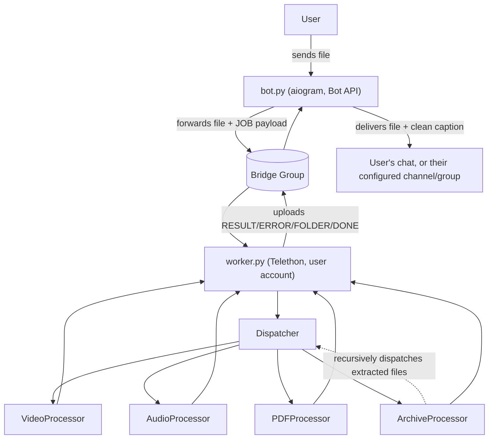

# Telegram File Processor

A Telegram bot that receives a file (video, audio, PDF, or archive), processes it, and delivers the result back — either to the user directly or to a channel/group of their choice.

- **Video** → re-encoded to MP4, optional logo watermark (auto-sized + positioned), thumbnail, or extracted to MP3 / M4A / voice note.
- **Audio** → re-tagged (title, artist, cover) and delivered as a real playable audio message.
- **PDF** → compressed automatically once it's over a size threshold.
- **Archives** (`.zip` / `.rar` / `.7z`, password-protected included) → extracted recursively, folder structure preserved and announced in order, matching audio/PDF pairs grouped together, each file processed by type.

Everything is configurable per-user via an in-chat `/settings` menu (default quality, watermark, upload target, caption, sort order, filename cleanup, etc.), with inline-keyboard overrides per file.

## Architecture

Two long-running processes talk to each other only through a private Telegram group (the **bridge**), using a small JSON protocol — never direct function calls. This is what makes it possible to run `bot.py` (lightweight, Bot API) and `worker.py` (does the heavy lifting, needs a full user account) as separate processes, possibly on different machines.



See [`docs/architecture.md`](docs/architecture.md) for the full write-up (bridge protocol, job lifecycle, settings system, archive folder-walk logic).

## Requirements

- Python 3.10+
- `ffmpeg` (and `ffprobe`) on `PATH`
- The real `unrar` CLI on `PATH` (for `.rar` archives, including multi-volume/password-protected ones) — Debian/Ubuntu's default `unrar-free` package is a different, less capable reimplementation and is not sufficient; install the genuine RarLab build (`apt-get install unrar` from the `contrib non-free` repos on Debian, or download from [rarlab.com](https://www.rarlab.com/rar_add.htm))
- A Telegram bot token ([@BotFather](https://t.me/BotFather))
- A Telegram user account's API ID/hash ([my.telegram.org](https://my.telegram.org)) — required because `worker.py` uses a full user account (via Telethon) to bypass the Bot API's 20MB/50MB download limits
- A private Telegram group with both the bot and the user account added (the "bridge")

## Setup

```bash
git clone <this repo>
cd telegram-file-processor
cp .env.example .env    # fill in the values below
pip install -r requirements.txt
```

| Variable       | Description                                             |
|----------------|-----------------------------------------------------------|
| `API_ID`       | From my.telegram.org, for the Telethon user account      |
| `API_HASH`     | From my.telegram.org                                      |
| `BOT_TOKEN`    | From @BotFather                                            |
| `GROUP_ID`     | Numeric ID of the private bridge group (bot + user account both members) |
| `SESSION_NAME` | Any name for the Telethon session file                    |

Run both processes (they're independent — restart either one without affecting the other):

```bash
python bot.py
python worker.py
```

## Usage

Send a file to the bot in a private chat. For video, you'll get an inline-keyboard prompt for quality/format (144p–720p, MP3, M4A, voice note); every file type then gets a review screen (rename, thumbnail, watermark, caption, delivery target) before you confirm. Use `/settings` any time to change your defaults.

## Project structure

```
bot.py                  # user-facing entrypoint (aiogram, Bot API)
worker.py                # processing entrypoint (Telethon, user account)
config.py                # env-backed settings (paths, ffmpeg, telegram, processing profiles)

core/                    # shared, framework-agnostic building blocks
  job.py                 # Job + OutputFile dataclasses (the unit of work)
  job_options.py          # per-job user choices (quality, watermark, target, ...)
  protocol.py              # bridge wire format (encode/decode + message builders)
  constants.py             # MessageType / JobStatus enums
  registry.py               # processor plugin registry (see below)
  password_broker.py         # async request/response bridge for archive passwords
  logger.py                   # per-process (bot/worker) log files

dispatcher/dispatcher.py   # routes a Job to the right registered processor
processors/                 # one file per file-type handler (video/audio/pdf/archive)
services/                    # Telegram I/O, ffmpeg wrapper, tagging, per-user settings storage
utils/                         # small stateless helpers (file-type sniffing, EXCLUDE text stripping)
```

### Adding a new file type

Processors are self-registering — there's no big if/elif to edit:

```python
# processors/image.py
from core.registry import register_processor

@register_processor("IMAGE")
class ImageProcessor:
    async def process(self, job):
        ...
```

Then add one import line in `dispatcher/dispatcher.py` so the module actually loads, and update `utils/filetype.py` if the new type needs its own detection rule. That's it.

## Roadmap

See [`ROADMAP.md`](ROADMAP.md).

## Contributing

See [`CONTRIBUTING.md`](CONTRIBUTING.md). If you're an AI coding agent (Claude Code, Cursor, Aider, etc.), read [`CLAUDE.md`](CLAUDE.md) and [`AGENTS.md`](AGENTS.md) first — they cover the gotchas that aren't obvious from the code alone.
