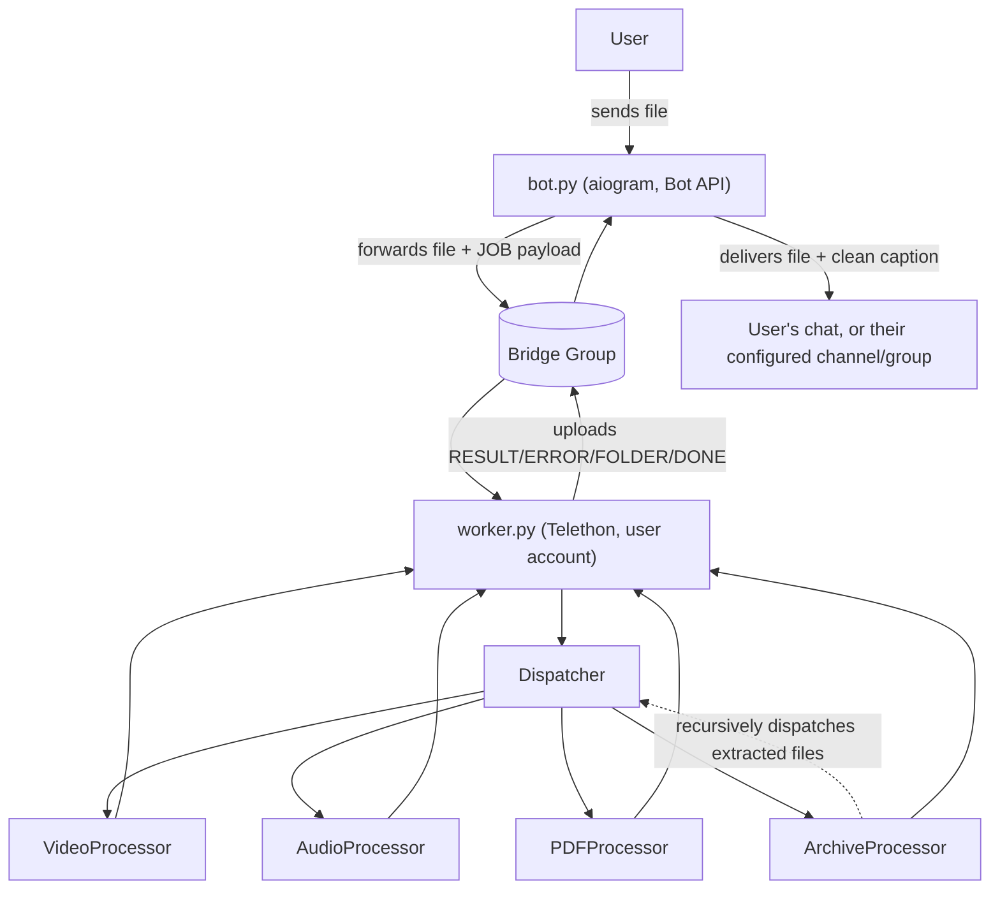

# Telegram File Processor

A Telegram bot that receives a file (video, audio, PDF, or archive), processes it, and delivers the result back — either to the user directly or to a channel/group of their choice.

- **Video** → re-encoded to MP4, optional logo watermark (auto-sized + positioned), thumbnail, or extracted to MP3 / M4A / voice note.
- **Audio** → re-tagged (title, artist, cover) and delivered as a real playable audio message.
- **PDF** → compressed automatically once it's over a size threshold.
- **Archives** (`.zip` / `.rar` / `.7z`, password-protected included) → extracted recursively, folder structure preserved and announced in order, matching audio/PDF pairs grouped together, each file processed by type.

Everything is configurable per-user via an in-chat `/settings` menu (default quality, watermark, upload target, caption, sort order, filename cleanup, etc.), with inline-keyboard overrides per file.

## Architecture

Two long-running processes talk to each other only through a private Telegram group (the **bridge**), using a small JSON protocol — never direct function calls. This is what makes it possible to run `bot.py` (lightweight, Bot API) and `worker.py` (does the heavy lifting, needs a full user account) as separate processes, possibly on different machines.


```mermaid
graph TD
    User -->|sends file| Bot["bot.py (aiogram, Bot API)"]
    Bot -->|forwards file + JOB payload| Bridge[("Bridge Group")]
    Bridge --> Worker["worker.py (Telethon, user account)"]
    Worker --> Dispatcher
    Dispatcher --> VideoProcessor
    Dispatcher --> AudioProcessor
    Dispatcher --> PDFProcessor
    Dispatcher --> ArchiveProcessor
    ArchiveProcessor -.recursively dispatches extracted files.-> Dispatcher
    VideoProcessor --> Worker
    AudioProcessor --> Worker
    PDFProcessor --> Worker
    ArchiveProcessor --> Worker
    Worker -->|uploads RESULT/ERROR/FOLDER/DONE| Bridge
    Bridge --> Bot
    Bot -->|delivers file + clean caption| Destination["User's chat, or their configured channel/group"]
```

See [`docs/architecture.md`](docs/architecture.md) for the full write-up (bridge protocol, job lifecycle, settings system, archive folder-walk logic).

## Requirements

- Python 3.10+
- `ffmpeg` (and `ffprobe`) on `PATH`
- The real `unrar` CLI on `PATH` (for `.rar` archives, including multi-volume/password-protected ones) — Debian/Ubuntu's default `unrar-free` package is a different, less capable reimplementation and is not sufficient; install the genuine RarLab build (`apt-get install unrar` from the `contrib non-free` repos on Debian, or download from [rarlab.com](https://www.rarlab.com/rar_add.htm))
- A Telegram bot token ([@BotFather](https://t.me/BotFather))
- A Telegram user account's API ID/hash ([my.telegram.org](https://my.telegram.org)) — required because `worker.py` uses a full user account (via Telethon) to bypass the Bot API's 20MB/50MB download limits
- A private Telegram group with both the bot and the user account added (the "bridge")

## Setup

```bash
git clone <this repo>
cd telegram-file-processor
cp .env.example .env    # fill in the values below
pip install -r requirements.txt
```

### Running long-term (recommended): systemd

The bot and the worker are two independent processes — on a VPS, run both under systemd so they survive terminal closure and restart on crash (`Restart=on-failure`). Example units are provided in [`deploy/`](deploy/):

```bash
sudo cp deploy/telegram-bot.service deploy/telegram-worker.service /etc/systemd/system/
# then edit both files: set User= and WorkingDirectory= to your deployment's
# user and project path (e.g. /opt/telegram-file-processor)
sudo systemctl daemon-reload
sudo systemctl enable --now telegram-bot telegram-worker
```

Check status/logs with `systemctl status telegram-bot` / `journalctl -u telegram-worker -f` (each process also writes its own `logs/bot.log` / `logs/worker.log` in the project directory). Both processes talk to each other only through the Telegram bridge group, so either can restart independently — there is no ordering requirement between the two units. For a quick manual test you can still run `python bot.py` and `python worker.py` in two terminals, but that's not the recommended way to run them long-term.

| Variable       | Description                                             |
|----------------|-----------------------------------------------------------|
| `API_ID`       | From my.telegram.org, for the Telethon user account      |
| `API_HASH`     | From my.telegram.org                                      |
| `BOT_TOKEN`    | From @BotFather                                            |
| `GROUP_ID`     | Numeric ID of the private bridge group (bot + user account both members) |
| `SESSION_NAME` | Any name for the Telethon session file                    |
| `ADMIN_IDS` | *(optional)* Comma-separated numeric chat IDs of the bot admin(s). Leave empty to let anyone use the bot |
| `ADMIN_CONTACT_USERNAME` | *(optional)* Shown to unauthorized users so they know who to contact for access, e.g. `@your_admin` |
| `MAX_FILE_SIZE` | *(optional)* Maximum accepted file size in bytes (default: 5 GiB). Files whose declared Telegram size exceeds this are rejected by the worker **before** download starts, and the user gets a Persian error message |
| `DISK_SPACE_CHECK_THRESHOLD` | *(optional)* Only run the free-disk-space guard for files whose declared size exceeds this, in bytes (default: 256 MiB). Smaller files skip the check entirely |
| `DISK_SPACE_SAFETY_FACTOR` | *(optional)* How many bytes of free space must be available per declared input byte before a large file may be downloaded (default: `2.0`) — ffmpeg re-encoding and archive extraction need working space beyond the raw input. Checked against `shutil.disk_usage` on the `downloads/`, `temp/` and `outputs/` paths |
| `MAX_CONCURRENT_JOBS` | *(optional)* How many jobs may run the heavy processing step (ffmpeg re-encode / archive extraction) at the same time (default: `2`). Additional jobs queue and are processed in arrival order; downloads are not counted against this limit |
| `RATE_LIMIT_MAX_FILES` | *(optional)* Per-user submission cap: at most this many new files per `RATE_LIMIT_WINDOW_MINUTES` (default: `5`). Set to `0` to disable rate limiting entirely. Over-the-cap submissions get a friendly Persian "wait a bit" message instead of being processed |
| `RATE_LIMIT_WINDOW_MINUTES` | *(optional)* Sliding-window size (in minutes) for the per-user submission cap (default: `10`) |
| `HEARTBEAT_INTERVAL_SECONDS` | *(optional)* How often (in seconds) the worker sends a liveness "heartbeat" through the bridge group (default: `300`). The admin's `/status` command reports how recent the last heartbeat was, so a crashed worker is noticeable without SSHing in |

When `ADMIN_IDS` is set, an admin gets `/admin` — a panel to add a user (choosing how long their access lasts: 1 week / 3 months / 6 months / 1 year / unlimited), renew/change someone's expiry later, or enable/disable a user without losing their record. Users can be identified either by forwarding one of their messages or by typing their numeric id directly (in which case the admin can optionally attach a name/username by hand). This data lives in a small SQLite database (`config_data/access.db`), not a plain file.

Run both processes (they're independent — restart either one without affecting the other):

```bash
python bot.py
python worker.py
```

## Usage

Send a file to the bot in a private chat. For video, you'll get an inline-keyboard prompt for quality/format (144p–720p, MP3, M4A, voice note); every file type then gets a review screen (rename, thumbnail, watermark, caption, delivery target) before you confirm. Use `/settings` any time to change your defaults.

**Admins** additionally have `/admin` (the user-management panel) and `/status` — a liveness check on the worker process, driven by the heartbeat the worker sends through the bridge every `HEARTBEAT_INTERVAL_SECONDS`. `/status` says whether the worker has been seen recently, so a crashed worker is noticeable without SSHing into the server.

### Sending a direct file link (URL upload)

Instead of uploading a file, you can paste a **direct download link** (a message that is just an `http://` or `https://` URL ending in a supported file type, e.g. `https://example.com/course.part1.rar`). The bot validates the link, then asks what should happen to the file after it's downloaded:

- **⬆️ Direct send (no processing)** — the file is streamed from the link to the server and delivered to you exactly as-is, with no conversion, watermark, or any other change. Fastest option.
- **⚙️ Full processing** — the file enters the exact same quality/options/target flow as an uploaded file (quality, watermark, thumbnails, archive extraction, …) and is processed identically.

Both modes enforce the same size/type limits and run through the same security checks; the only difference is whether the processing pipeline runs. Other constraints:

- `http`/`https` links only; links pointing at local/private network addresses (127.0.0.1, 10.x, 192.168.x, 169.254.x, …) are rejected for security (SSRF protection).
- The link's filename extension decides the file type — links without a recognizable type are rejected before anything is downloaded.
- `MAX_FILE_SIZE` is enforced via the response's `Content-Length` header **and** as a hard cap while streaming (a missing or lying header can't overflow the disk), and the free-disk-space guard applies as usual.
- Per-user rate limiting counts a link exactly like an uploaded file.

### Commands

Registered automatically into Telegram's native "/" menu on bot startup (`setMyCommands`) — regular users see only the public commands; each admin additionally sees the admin commands in their own chat. **This table is required maintenance: any change that adds or modifies a command must update it (and `utils/bot_commands.py`, which feeds the actual menu) in the same change.**

| Command  | Who can use it | What it does |
|----------|----------------|--------------|
| `/start`    | Everyone | Welcome message; also registers unregistered users as "pending" for the admin |
| `/settings` | Everyone | Per-user defaults: quality, watermark, upload target, caption, sort order, filename cleanup, … |
| `/cancel`   | Everyone | Cancels whatever in-progress input flow (settings prompt, admin flow, file option prompt) you're in |
| `/admin`    | Admins only | Opens the user-management panel (add/renew/disable/delete authorized users, list, broadcast, stats) |
| `/status`   | Admins only | Reports whether the worker has sent a heartbeat recently — detects a crashed worker without SSHing in |

(URL upload needs no command — just paste a direct link, see the section above.)

Files larger than `MAX_FILE_SIZE` (default 5 GiB) are rejected immediately — before anything is downloaded — and you'll get a clear Persian error instead. For large files (over `DISK_SPACE_CHECK_THRESHOLD`, default 256 MiB) the worker also verifies the server actually has enough free disk space (declared size × `DISK_SPACE_SAFETY_FACTOR`) before downloading; if it doesn't, you'll get a "not enough disk space" error rather than a mid-processing failure.

To keep the server responsive, each user can submit at most `RATE_LIMIT_MAX_FILES` (default 5) new files per `RATE_LIMIT_WINDOW_MINUTES` (default 10) — after that you'll get a "please wait" message until the window frees up. Archive-password replies and in-progress option screens are never blocked by this.

## Project structure

```
bot.py                  # thin entrypoint: creates the Dispatcher, registers every Router, runs main()
worker.py                # processing entrypoint (Telethon, user account)
config.py                # env-backed settings (paths, ffmpeg, telegram, processing profiles)
state.py                  # shared in-process mutable state (pending files/photos, awaited-input states, admin scratch data)

handlers/                  # one aiogram 3 Router per domain — this is where bot.py's logic actually lives now
  admin.py                    # /admin, admin:* callbacks, admin_* awaited-input states
  settings.py                  # /settings, s:*/sq:*/slogopos:*/starget:* callbacks, settings_* states
  files.py                      # quality/options/target callbacks, finalize_job, file:* states
  photo.py                       # plain photo -> watermark confirmation flow
  bridge.py                       # messages coming back from worker.py through the bridge group
  core.py                          # /start, /cancel, the catch-all handle_private_message, handle_awaited_input

keyboards/                  # every inline-keyboard builder, grouped the same way as handlers/
models/                       # PendingFile / PendingPhoto dataclasses
utils/                          # small helpers: file-type sniffing, EXCLUDE text stripping, access-control checks

core/                    # shared, framework-agnostic building blocks
  job.py                 # Job + OutputFile dataclasses (the unit of work)
  job_options.py          # per-job user choices (quality, watermark, target, ...)
  protocol.py              # bridge wire format (encode/decode + message builders)
  constants.py             # MessageType / JobStatus enums
  registry.py               # processor plugin registry (see below)
  password_broker.py         # async request/response bridge for archive passwords
  logger.py                   # per-process (bot/worker) log files

dispatcher/dispatcher.py   # routes a Job to the right registered processor
processors/                 # one file per file-type handler (video/audio/pdf/archive)
services/                    # Telegram I/O, ffmpeg wrapper, tagging, SQLite-backed stores (access/settings/pending-user), target resolution, expiry reminders

tests/                        # pytest suite for every pure-logic module above (no live Telegram needed)
qa-userbot/                     # separate tool: a real Telegram user account for live end-to-end testing (see its own README)
```

### Adding a new file type

Processors are self-registering — there's no big if/elif to edit:

```python
# processors/image.py
from core.registry import register_processor

@register_processor("IMAGE")
class ImageProcessor:
    async def process(self, job):
        ...
```

Then add one import line in `dispatcher/dispatcher.py` so the module actually loads, and update `utils/filetype.py` if the new type needs its own detection rule. That's it.

## Roadmap

See [`ROADMAP.md`](ROADMAP.md).

## Contributing

See [`CONTRIBUTING.md`](CONTRIBUTING.md). If you're an AI coding agent (Claude Code, Cursor, Aider, etc.), read [`CLAUDE.md`](CLAUDE.md) and [`AGENTS.md`](AGENTS.md) first — they cover the gotchas that aren't obvious from the code alone.
